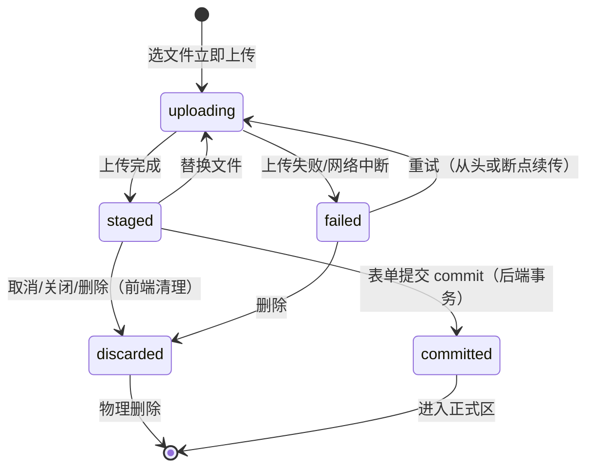

# db-upload 组件 staging 暂存方案改造

## 适用范围

**适用**：DBM 平台全部「在表单 / 弹窗内由用户上传文件后再提交」的场景。如版本包、SQL 文件、配置文件、数据备份等。

**不适用**：自动化 / 后台异步从外部拉取的文件；纯查看 / 下载场景。

> 完整适用范围与不适用场景见需求 §1。文件大小上限 / 类型白名单不强制，由业务侧定义并在前端「选择即拦截」。

## 核心机制：staging 暂存 + commit

### 文件生命周期

| 状态 | 含义 | 业务可见性 |
|------|------|-----------|
| 暂存中（staging） | 已上传到服务端但未与业务实体绑定 | 仅当前编辑表单可见，不进入业务列表 / 不被消费检索 |
| 已提交（committed） | 表单提交成功，文件归属业务实体 | 进入正式区，被消费场景正常检索 |
| 已废弃（discarded） | 用户取消 / 超时未提交 | 物理删除 |

状态单向流转：**暂存 → 已提交 / 已废弃**，已提交不可回退。staging 与正式区物理或逻辑隔离（独立 bucket / 目录 / 命名空间），消费场景永不读 staging；staging 文件不与业务实体建立外键关系。

### 流程概览

```
选文件 → 立即上传 staging（行内进度条）→ 已暂存 → 提交触发 commit 入正式区
                                        ↘ 用户取消 / 关闭 → 清理路径
                                        ↘ 超时未提交 → 后端兜底 24h 清理
```



## 改造总览

本 skill 指导三层改造：

1. **组件层**（`src/components/db-upload/`）— 扩展类型、Props、Emits、UI、状态机、清理钩子。详见 [组件改造规范](./references/component-spec.md)
2. **接口层**（`src/services/source/storage.ts`）— 约定 staging/commit/cleanup/断点续传接口契约。详见 [后端接口契约](./references/interface-contract.md)
3. **接入层**（业务表单）— 提交传参、取消/关闭清理、过期处理、重名规则、与 DbSideslider 置灰联动。详见 [业务表单接入指南](./references/integration-guide.md)

附加文档：
- [断点续传实现指引](./references/resume-upload.md) — 内容指纹、断点查询、续传请求（GB 级选做）
- [现有使用方迁移指南](./references/migration-guide.md) — 两个 ImportUpload + version-files UploadFile
- [i18n 文案清单](./references/i18n-checklist.md) — 需新增的 zh-cn/en 文案 key
- [交互 Demo](./assets/demo.html) — 可视化参考原型，浏览器直接打开

## 组件改造要点（摘要）

> 完整规范见 [组件改造规范](./references/component-spec.md)

### 类型扩展（`types.ts`）

- `UploadStatus` 新增 `STAGED = 'staged'`（对内状态，UI 仍呈现 3 态：上传中 / 上传成功 / 失败）
- `UploadFile` 新增字段：`tempId`（staging 引用凭证）、`errMsg`（失败原因）、`fingerprint`（断点续传内容指纹）、`uploadedBytes`（已传字节，断点续传用）
- 新增 `StagingFileRef` 类型：`{ tempId, name, path, md5, size }`，供 commit 时收集

### Props 新增（均可选，向后兼容）

| Prop | 类型 | 说明 |
|------|------|------|
| `stagingUploadHandler` | `(options) => void` | staging 上传处理，替代直接 `url`（推荐） |
| `duplicateChecker` | `(file, fileList) => boolean \| string[]` | 同表重名规则，选择即拦截 |
| `resumeable` | `boolean` | 是否启用断点续传（GB 级建议 true） |
| `getFingerprint` | `(file) => Promise<string>` | 内容指纹计算（断点续传用） |
| `cleanupHandler` | `(tempIds: string[]) => Promise<void>` | 清理 staging 文件 |

### Emits 新增

| 事件 | 载荷 | 说明 |
|------|------|------|
| `staged` | `(file, stagingRef, fileList)` | 单文件暂存完成，携带 `StagingFileRef` |
| `all-staged` | `(fileList)` | 全部文件到 staged，用于联动提交按钮 |
| `cleaned` | `(tempIds)` | 清理完成 |

### 暴露方法（defineExpose）

| 方法 | 说明 |
|------|------|
| `getStagingRefs()` | 返回 `StagingFileRef[]`，供表单提交时收集 temp_id |
| `isReadyToCommit` | computed，全部 staged 才 true |
| `submitDisabledReason` | computed，置灰原因（优先级：上传中 > 失败 > 无成功） |
| `cleanupAll()` | 批量清理所有 staging（取消/关闭时调，最佳努力） |
| `cleanupOne(tempId)` | 清理单个 staging（删除/替换时调） |

### UI 规范

- **入口**：子表底部单一入口「+ 点击上传文件」，点击直接弹文件选择器（原生 `multiple`），选中即新增对应行数并立即上传，**无「先加空行再选文件」两步**
- **行内 3 态**（单行内切换，不暴露 staging / 暂存术语）：

  | 内部状态 | 行内呈现 | 操作列 |
  |---------|---------|--------|
  | uploading | 文件名 + 大小 + ⟳ 上传中（蓝）+ 4-6px 进度条 + 百分比 | 删除 |
  | staged | 文件名 + 大小 + ✓ 上传成功（绿） | 替换 / 删除 |
  | failed | 文件名 + ✗ 失败原因（红，默认「上传失败，请重试」） | 重试 / 删除 |

- **进度条**：行内紧贴文件名下方，高 4-6px，百分比必显，至少每秒更新，100% 立即切「上传成功」并隐藏进度条
- **重名拦截**：选择重名文件时立即拦截（不入子表占位行），按钮下方红字提示 4-5s 自动消失或下次点击清除
- **提交置灰**：通过 `submitDisabledReason` 联动父表单提交按钮，tooltip 文案优先级「上传中 > 失败 > 无成功文件」

### 操作按钮

| 按钮 | 出现状态 | 触发动作 |
|------|---------|---------|
| 删除 | 全部 3 态 | 中断进行中上传（如有）+ 发清理请求删 staging（如有）+ 移除整行 |
| 替换 | staged | 先发清理请求删旧 staging，再弹文件选择器选新文件，行回到 uploading |
| 重试 | failed | 同一文件重新上传（仅同一会话有效，浏览器持有原 File 引用）；启用断点续传则从断点继续 |

## 后端接口契约（摘要）

> 完整契约见 [后端接口契约](./references/interface-contract.md)。⚠️ 以下路径与字段为推荐约定，**待后端确认**。

| 接口 | 方法 | 推荐路径 | 说明 |
|------|------|---------|------|
| staging 上传 | POST | `/apis/core/storage/staging/upload/` | 接收文件，返回 `temp_id` + 引用凭证 |
| commit | POST | `/apis/core/storage/staging/commit/` | 事务内移入正式区 + 落业务元数据 |
| 清理（单/批） | POST/DELETE | `/apis/core/storage/staging/cleanup/` | 接前端请求立即删 staging |
| 断点查询 | GET | `/apis/core/storage/staging/resume/` | 按指纹查询已传字节 |
| 断点续传 | PATCH/PUT | `/apis/core/storage/staging/resume/` | 从 offset 续传 |

后端兜底：超过 24h 未 commit 的 staging 自动物理清理（24h 为默认值，业务侧可调整）。

## 业务表单接入要点（摘要）

> 完整指南见 [业务表单接入指南](./references/integration-guide.md)

1. **提交传参**：表单 submit 时 `dbUploadRef.getStagingRefs()` → 携带 `temp_id` 列表调 commit 接口；commit 业务校验未过时 staging 保留，用户改字段重提复用
2. **取消/关闭清理**：`DbSideslider @closed` / `BkDialog @closed` → `dbUploadRef.cleanupAll()`；`before-close` 走 `leaveConfirm`
3. **过期处理**：commit 返回「staging 不存在」→ 表单顶部 banner「部分文件已过期，请重新上传」+ 失效行行级标签「该文件已过期，请重新上传」
4. **重名规则**：传 `duplicateChecker`，选择即拦截不入子表
5. **与 DbSideslider 联动**：`<DbSideslider :disabled-confirm="uploadRef?.submitDisabledReason">`（复用现有 `disabledConfirm: boolean|string` + `v-bk-tooltips` 置灰模式）

## 边界情况处理

| 场景 | 处理 |
|------|------|
| 用户主动取消 / 关闭弹窗 / 切换销毁 | 前端发清理请求批量删除本次所有 staging |
| 浏览器刷新 / 崩溃 / Tab 关闭 | 前端无机会清理，依赖后端兜底 24h 自动清理；用户重新进入需从头操作 |
| 提交时 staging 已过期（填表 24h+） | 后端 commit 检测不存在则阻止提交并定位失效行 |
| 多文件 | 推荐并行上传，每行独立状态机，单行失败不影响其他行，全部 staged 才允许提交 |
| 断点续传 | GB 级建议启用，从断点继续不回到 0%，基于内容指纹识别（与文件名无关） |
| 失败文案 | 前端不推断原因，统一「上传失败，请重试」；仅后端返回明确业务 message 时用业务文案 |

## 实施步骤

改造时按以下顺序进行：

1. **阅读参考文档**：先读 [组件改造规范](./references/component-spec.md) 和 [后端接口契约](./references/interface-contract.md)
2. **扩展类型**（`src/components/db-upload/types.ts`）：新增 `STAGED` 状态、`UploadFile` 字段、`StagingFileRef` 等
3. **新增服务函数**（`src/services/source/storage.ts`）：按契约实现 staging/commit/cleanup（接口未就绪时先 mock）
4. **改造组件**（`src/components/db-upload/Index.vue` + `index.less`）：Props/Emits/UI/状态机/清理钩子/提交置灰
5. **接入业务表单**：参考 [业务表单接入指南](./references/integration-guide.md)，以 version-files 为主示例
6. **迁移现有使用方**：参考 [迁移指南](./references/migration-guide.md)
7. **新增 i18n 文案**：参考 [i18n 文案清单](./references/i18n-checklist.md)
8. **如需断点续传**：参考 [断点续传实现指引](./references/resume-upload.md)
9. **对照验收清单**逐项验证（见下）

## 验收清单

> 对应需求 §6，逐项验证

### 核心机制
- [ ] 选择文件后立即上传到 staging，不等「提交」；任何消费场景均检索不到 staging 文件
- [ ] 表单「提交」触发后端 commit，文件移入正式区 + 业务元数据落库在同一事务内完成
- [ ] commit 业务校验未过时 staging 文件保留，用户改字段重提可复用

### UI 与状态切换
- [ ] 子表只有 1 个上传入口「+ 点击上传文件」，支持原生多选（一次选 N 个 → 一次新增 N 行 + 各自独立上传）；无独立的「添加空行」按钮
- [ ] 文件行内 3 态切换（上传中 / 上传成功 / 失败）正确，UI 文案不暴露「暂存 / staging」等技术术语
- [ ] 上传中行内进度条紧贴文件名下方，4-6px 高，至少每秒更新；100% 立即切「上传成功」
- [ ] 提交按钮置灰策略覆盖 3 种 tooltip：请等待文件上传完成（任意上传中）/ 存在失败文件，请重试或删除（任意失败）/ 请至少上传 1 个文件（无上传成功行）
- [ ] 失败行变红 + ✗ 图标 + 简短原因 + 「重试」/「删除」按钮可用
- [ ] 业务侧定义同表内重名规则后，选择重名文件时被立即拦截，按钮下方红字提示（不进入子表占位行），4-5s 自动消失或下次点击清除

### 清理与回滚
- [ ] 关闭弹窗 / 行删除 / 行替换时前端发清理请求，后端立即删除对应 staging 文件
- [ ] 「上传中」行点删除：立即中断 + 清理 + 移除整行（一次操作完成）
- [ ] 浏览器刷新 / 崩溃后后端兜底任务在 24h 内清理未 commit 的 staging 文件
- [ ] 提交时 staging 已过期：阻止提交并定位失效行，文案「部分文件已过期，请重新上传」

### 多文件 / 边界
- [ ] 多行并行上传互不阻塞，全部到「上传成功」才允许提交
- [ ] 失败兜底文案统一为「上传失败，请重试」（不区分断网 / 超时 / 连接中断等无法准确归因的场景）；后端返回明确业务错误 message 时使用后端文案
- [ ] 文件类型 / 大小白名单（业务侧定义后）在选择文件时立即拦截，不发起上传请求

## 参考资源

- [组件改造规范](./references/component-spec.md) — 类型、Props、Emits、UI、状态机、清理钩子完整规范
- [后端接口契约](./references/interface-contract.md) — staging/commit/cleanup/断点续传接口签名与响应结构
- [业务表单接入指南](./references/integration-guide.md) — 提交传参、取消清理、过期处理、重名、DbSideslider 联动
- [断点续传实现指引](./references/resume-upload.md) — 内容指纹、断点查询、续传请求
- [现有使用方迁移指南](./references/migration-guide.md) — ImportUpload + version-files UploadFile 迁移
- [i18n 文案清单](./references/i18n-checklist.md) — 需新增的 zh-cn/en 文案 key
- [交互 Demo](./assets/demo.html) — 可视化参考原型（浏览器直接打开）

## 现有代码参考

- `src/components/db-upload/Index.vue` — 待改造的通用上传组件（已有 3 态、customRequest、进度条、重试、删除）
- `src/components/db-upload/types.ts` — 待扩展的类型定义
- `src/components/db-sideslider/index.vue` — `disabledConfirm: boolean|string` + `v-bk-tooltips` 置灰模式可复用
- `src/services/source/storage.ts` — `createBkrepoAccessToken` 等，staging 服务函数将新增于此
- `src/services/http/index.ts` — `http.get/post/put/delete` 封装，返回已解包 `Promise<T>`
- `src/services/types/common.ts` — `BaseResponse<T> { code, data, message, request_id }`
- `src/views/version-files/v2/.../version-files/components/UploadFile.vue` — 已有「准 staging」雏形（bkrepo token + 子表），接入指南主示例
- `src/views/db-manage/{mysql,tendb-cluster}/partition-manage/components/excel-import/components/ImportUpload.vue` — 待迁移使用方
