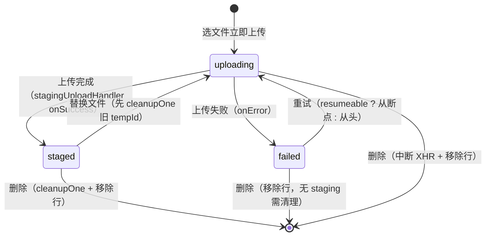

# 组件改造规范：db-upload

> 本文档指导 `src/components/db-upload/` 的完整改造。改造遵循**向后兼容**原则：所有新增 Props 均可选，旧用法（直接 `url` 上传、`customRequest`）保留可用，未迁移场景不受影响。
>
> 现有组件已有：3 态（uploading/success/fail）、`customRequest`、`beforeUpload`、`limit`、`size`、拖拽、4px 进度条、重试、删除。本规范在此基础上扩展 staging 语义。

## 1. 类型扩展（`src/components/db-upload/types.ts`）

### 1.1 UploadStatus 新增 STAGED

```ts
export enum UploadStatus {
  FAIL = 'fail',
  NEW = 'new',
  STAGED = 'staged',    // 新增：已暂存到 staging（对内状态）
  SUCCESS = 'success',  // 保留：旧用法直接上传成功（向后兼容）
  UPLOADING = 'uploading',
}
```

> **UI 呈现说明**：`STAGED` 在 UI 上呈现为「上传成功」（绿 ✓），不暴露 staging 术语。`SUCCESS` 保留给旧用法（无 staging 的直接上传成功）。组件内部判断「可提交」时，`STAGED` 和 `SUCCESS` 都算「成功」。

### 1.2 UploadFile 扩展字段

```ts
export interface UploadFile {
  name: string;
  percentage?: number;
  raw: UploadRawFile;
  response?: unknown;
  size: number;
  status: UploadStatus;
  statusText?: string;
  uid: number;
  url?: string;
  // ===== 新增字段（staging 方案） =====
  /** staging 引用凭证，上传成功后由服务端返回 */
  tempId?: string;
  /** staging 区相对路径（调试 / 日志用） */
  stagingPath?: string;
  /** 文件 MD5（服务端返回，commit 时校验） */
  md5?: string;
  /** 失败原因（failed 态显示，前端不推断原因时用兜底文案） */
  errMsg?: string;
  /** 内容指纹（断点续传用，与文件名无关） */
  fingerprint?: string;
  /** 已传字节数（断点续传用，从断点继续时作为起始 offset） */
  uploadedBytes?: number;
  /** staging 过期时间（ISO 字符串，服务端返回） */
  expireAt?: string;
  /** 是否已过期（commit 时由父组件标记） */
  expired?: boolean;
}
```

### 1.3 新增 StagingFileRef

供 commit 时收集的 staging 文件引用：

```ts
/** commit 时传给后端的 staging 文件引用 */
export interface StagingFileRef {
  tempId: string;
  name: string;
  path?: string;
  md5?: string;
  size: number;
}
```

### 1.4 新增 Handler / Hook 类型

```ts
/** staging 上传处理函数（替代直接 url） */
export type StagingUploadHandler = (options: StagingUploadOptions) => void;

export interface StagingUploadOptions {
  file: File;
  /** 进度回调，percentage 0-100 */
  onProgress: (percentage: number, uploadedBytes?: number) => void;
  /** 暂存成功回调，携带服务端返回的引用凭证 */
  onSuccess: (result: StagingUploadResult) => void;
  /** 失败回调，errMsg 为兜底文案或后端业务 message */
  onError: (errMsg: string) => void;
  /** 断点续传：已传字节数（>0 时从断点继续） */
  resumeOffset?: number;
  /** 断点续传：内容指纹 */
  fingerprint?: string;
}

/** 服务端 staging 上传响应（与接口契约一致） */
export interface StagingUploadResult {
  temp_id: string;
  name: string;
  path?: string;
  md5?: string;
  size: number;
  expire_at?: string;
}

/** 同表重名检查器：返回 true 表示重名（拦截），返回 string[] 表示多个重名文件名 */
export type DuplicateChecker = (
  file: File,
  fileList: UploadFile[],
) => boolean | string[];

/** 内容指纹计算函数（断点续传用） */
export type FingerprintFn = (file: File) => Promise<string>;

/** 清理处理函数 */
export type CleanupHandler = (tempIds: string[]) => Promise<void>;
```

### 1.5 导出（`index.ts`）

```ts
export type {
  CleanupHandler,
  DuplicateChecker,
  FingerprintFn,
  StagingFileRef,
  StagingUploadHandler,
  StagingUploadOptions,
  StagingUploadResult,
} from './types';
```

## 2. Props 新增（`Index.vue`）

所有新增 Props 均可选，向后兼容：

```ts
interface Props {
  // ...existing props (accept, autoUpload, customRequest, data, disabled, fileIcon,
  //   handleResCode, headers, limit, method, multiple, name, size, tip, url, withCredentials,
  //   beforeRemove, beforeUpload)...

  /** staging 上传处理函数（推荐，替代直接 url） */
  stagingUploadHandler?: StagingUploadHandler;
  /** 同表重名检查器，选择即拦截不入子表 */
  duplicateChecker?: DuplicateChecker;
  /** 是否启用断点续传（GB 级建议 true） */
  resumeable?: boolean;
  /** 内容指纹计算函数（resumeable=true 时必传） */
  getFingerprint?: FingerprintFn;
  /** 清理处理函数（删除/替换/取消时调） */
  cleanupHandler?: CleanupHandler;
  /** 业务场景标识（传给 staging 接口，便于后端分目录） */
  scene?: string;
}
```

默认值：

```ts
withDefaults(defineProps<Props>(), {
  // ...existing defaults...
  stagingUploadHandler: undefined,
  duplicateChecker: undefined,
  resumeable: false,
  getFingerprint: undefined,
  cleanupHandler: undefined,
  scene: '',
});
```

## 3. Emits 新增

```ts
type Emits = {
  // ...existing (change, delete, done, error, exceed, progress, success)...
  /** 单文件暂存完成，携带 StagingFileRef */
  (e: 'staged', file: UploadFile, stagingRef: StagingFileRef, fileList: UploadFile[]): void;
  /** 全部文件到 staged/success，用于联动提交按钮 */
  (e: 'all-staged', fileList: UploadFile[]): void;
  /** 清理完成 */
  (e: 'cleaned', tempIds: string[]): void;
  /** 重名拦截（按钮下方红字提示） */
  (e: 'duplicate-rejected', fileNames: string[]): void;
};
```

## 4. 暴露方法（defineExpose）

```ts
defineExpose({
  // ...existing (clearFiles, fileList, handleRemove, handleRetry, submit)...
  /** 返回 staging 文件引用列表，供表单提交时收集 temp_id */
  getStagingRefs: () => StagingFileRef[];
  /** 是否全部就绪可提交（所有行 staged/success，无 uploading/failed） */
  isReadyToCommit: ComputedRef<boolean>;
  /** 提交置灰原因（优先级：上传中 > 失败 > 无成功），为空字符串表示可提交 */
  submitDisabledReason: ComputedRef<string>;
  /** 批量清理所有 staging 文件（取消/关闭时调，最佳努力） */
  cleanupAll: () => Promise<void>;
  /** 清理单个 staging 文件（删除/替换时调） */
  cleanupOne: (tempId: string) => Promise<void>;
  /** 清除重名提示 */
  clearDuplicateTip: () => void;
});
```

### 4.1 isReadyToCommit 与 submitDisabledReason 实现

```ts
const isReadyToCommit = computed(() => {
  if (fileList.value.length === 0) return false;
  return fileList.value.every(
    (f) => f.status === UploadStatus.STAGED || f.status === UploadStatus.SUCCESS,
  );
});

const submitDisabledReason = computed(() => {
  if (fileList.value.length === 0) return t('请至少上传 1 个文件');
  const hasUploading = fileList.value.some((f) => f.status === UploadStatus.UPLOADING);
  if (hasUploading) return t('请等待文件上传完成');
  const hasFailed = fileList.value.some((f) => f.status === UploadStatus.FAIL);
  if (hasFailed) return t('存在失败文件，请重试或删除');
  const hasSuccess = fileList.value.some(
    (f) => f.status === UploadStatus.STAGED || f.status === UploadStatus.SUCCESS,
  );
  if (!hasSuccess) return t('请至少上传 1 个文件');
  return '';
});
```

> **优先级**：上传中 > 失败 > 无成功文件，给用户最具体的下一步指引。

### 4.2 getStagingRefs 实现

```ts
const getStagingRefs = (): StagingFileRef[] =>
  fileList.value
    .filter((f) => (f.status === UploadStatus.STAGED || f.status === UploadStatus.SUCCESS) && f.tempId)
    .map((f) => ({
      tempId: f.tempId!,
      name: f.name,
      path: f.stagingPath,
      md5: f.md5,
      size: f.size,
    }));
```

### 4.3 cleanupAll / cleanupOne 实现

```ts
const cleanupOne = async (tempId: string) => {
  if (!props.cleanupHandler || !tempId) return;
  try {
    await props.cleanupHandler([tempId]);
    emit('cleaned', [tempId]);
  } catch {
    // 最佳努力，失败不阻塞 UI，后端兜底会清理
  }
};

const cleanupAll = async () => {
  if (!props.cleanupHandler) return;
  const tempIds = fileList.value
    .filter((f) => (f.status === UploadStatus.STAGED || f.status === UploadStatus.SUCCESS) && f.tempId)
    .map((f) => f.tempId!);
  if (tempIds.length === 0) return;
  try {
    await props.cleanupHandler(tempIds);
    emit('cleaned', tempIds);
  } catch {
    // 最佳努力
  }
};
```

## 5. 状态机



### 5.1 状态切换核心逻辑

```ts
/** staging 上传（替代旧 upload 函数的 staging 路径） */
const startStagingUpload = async (rawFile: UploadRawFile) => {
  if (!props.stagingUploadHandler) {
    // 未提供 stagingUploadHandler，回退旧逻辑（向后兼容）
    upload(rawFile);
    return;
  }

  updateFile(rawFile.uid, { percentage: 0, status: UploadStatus.UPLOADING, errMsg: '' });

  // 断点续传：查询已传字节
  let resumeOffset = 0;
  let fingerprint: string | undefined;
  if (props.resumeable && props.getFingerprint) {
    try {
      fingerprint = await props.getFingerprint(rawFile);
      // 查询断点（由 stagingUploadHandler 内部处理或组件调 queryStagingResume）
      // 此处简化：fingerprint 与 resumeOffset 透传给 handler
    } catch {
      // 指纹计算失败，按从头上传处理
    }
  }

  props.stagingUploadHandler({
    file: rawFile,
    fingerprint,
    resumeOffset,
    onProgress: (percentage, uploadedBytes) => {
      updateFile(rawFile.uid, { percentage, uploadedBytes });
      const file = fileList.value.find((f) => f.uid === rawFile.uid);
      if (file) emit('progress', file, fileList.value);
    },
    onSuccess: (result) => {
      updateFile(rawFile.uid, {
        percentage: 100,
        status: UploadStatus.STAGED,
        tempId: result.temp_id,
        stagingPath: result.path,
        md5: result.md5,
        expireAt: result.expire_at,
      });
      const file = fileList.value.find((f) => f.uid === rawFile.uid);
      if (file) {
        emit('staged', file, { tempId: result.temp_id, name: result.name, path: result.path, md5: result.md5, size: result.size }, fileList.value);
        emit('done', file, fileList.value);
        checkAllStaged();
      }
    },
    onError: (errMsg) => {
      updateFile(rawFile.uid, {
        status: UploadStatus.FAIL,
        errMsg: errMsg || t('上传失败，请重试'),
      });
      const file = fileList.value.find((f) => f.uid === rawFile.uid);
      if (file) emit('error', file, fileList.value);
    },
  });
};

const checkAllStaged = () => {
  if (isReadyToCommit.value) {
    emit('all-staged', fileList.value);
  }
};
```

### 5.2 重试（resumeable ? 断点 : 从头）

```ts
const handleRetry = (file: UploadFile) => {
  const rawFile = file.raw;
  if (!rawFile) return;
  updateFile(file.uid, { percentage: file.uploadedBytes ? (file.uploadedBytes / file.size) * 100 : 0, status: UploadStatus.NEW, errMsg: '' });
  // resumeable 时保留 uploadedBytes 作为起始进度；否则重置为 0
  if (!props.resumeable) {
    updateFile(file.uid, { uploadedBytes: 0 });
  }
  validateAndUpload(rawFile);
};
```

> **重试仅同一会话有效**：浏览器持有原 `File` 引用才能重试；弹窗关闭 / 页面刷新后 `File` 失效，需用户重选文件。组件无需特殊处理，`file.raw` 失效时 `stagingUploadHandler` 自然报错。

### 5.3 替换（仅 staged）

```ts
const handleReplace = async (file: UploadFile) => {
  if (props.disabled) return;
  // 先清理旧 staging
  if (file.tempId) await cleanupOne(file.tempId);
  // 弹文件选择器选新文件
  pendingReplaceUid = file.uid;
  inputRef.value?.click();
};

// handleInputChange 中处理替换：
// if (pendingReplaceUid != null) { 替换该行文件并 startStagingUpload } else { 正常新增 }
```

## 6. 重名拦截

### 6.1 选择即拦截

```ts
const handleFiles = (files: File[]) => {
  if (props.disabled) return;
  const postFiles = Array.from(files);

  // 数量限制
  if (props.limit !== undefined && fileList.value.length + postFiles.length > props.limit) {
    emit('exceed', postFiles, fileList.value);
    return;
  }

  // 重名拦截（业务侧 duplicateChecker）
  let rejectedNames: string[] = [];
  if (props.duplicateChecker) {
    const accepted: File[] = [];
    postFiles.forEach((file) => {
      const result = props.duplicateChecker!(file, fileList.value);
      if (result === true) {
        rejectedNames.push(file.name);
      } else if (Array.isArray(result)) {
        rejectedNames = rejectedNames.concat(result);
      } else {
        accepted.push(file);
      }
    });
    if (rejectedNames.length > 0) {
      showDuplicateTip(rejectedNames);
      emit('duplicate-rejected', rejectedNames);
    }
    // 只上传未被拦截的
    accepted.forEach((file) => addAndUpload(file));
    return;
  }

  postFiles.forEach((file) => addAndUpload(file));
};
```

### 6.2 按钮下方红字提示（4-5s 自动消失）

```ts
const duplicateTipVisible = ref(false);
const duplicateTipText = ref('');
let duplicateTipTimer: ReturnType<typeof setTimeout> | null = null;

const showDuplicateTip = (names: string[]) => {
  if (names.length === 1) {
    duplicateTipText.value = t('已存在同名文件「x」，如需覆盖请用「替换」操作', { x: names[0] });
  } else {
    duplicateTipText.value = t('已忽略 n 个同名文件', { n: names.length }) + '：' + names.map((n) => `「${n}」`).join('、');
  }
  duplicateTipVisible.value = true;
  if (duplicateTipTimer) clearTimeout(duplicateTipTimer);
  duplicateTipTimer = setTimeout(() => {
    duplicateTipVisible.value = false;
  }, 4500);
};

const clearDuplicateTip = () => {
  duplicateTipVisible.value = false;
  if (duplicateTipTimer) clearTimeout(duplicateTipTimer);
};
```

> 重名文件**不进入子表占位行**，仅按钮下方红字提示。

## 7. UI 模板（`Index.vue`）

### 7.1 入口：单一「+ 点击上传文件」按钮

```vue
<!-- 替换原拖拽区域为按钮入口（保留拖拽可选） -->
<div class="db-upload-entry">
  <BkButton
    class="db-upload-entry-btn"
    :disabled="disabled"
    text
    theme="primary"
    @click="handleClick">
    <DbIcon type="plus-fill" />
    <span>{{ t('点击上传文件') }}</span>
    <span v-if="multiple" class="db-upload-entry-hint">{{ t('支持多选') }}</span>
  </BkButton>
  <!-- 重名红字提示 -->
  <Transition name="db-upload-tip-fade">
    <div v-if="duplicateTipVisible" class="db-upload-duplicate-tip">
      <DbIcon type="exclamation-fill" />
      <span>{{ duplicateTipText }}</span>
    </div>
  </Transition>
  <input
    ref="inputRef"
    :accept="accept"
    class="db-upload-trigger-input-file"
    :disabled="disabled"
    :multiple="multiple"
    type="file"
    @change="handleInputChange" />
</div>
```

> **保留拖拽**：如业务需要拖拽，可在按钮上方保留原拖拽区域，拖入文件等同点击选择。拖拽为可选增强，非规范强制。

### 7.2 文件列表行（3 态 + 进度条 + 操作）

```vue
<div
  v-for="file in fileList"
  :key="file.uid"
  class="db-upload-list-item"
  :class="{
    'db-upload-list-item-staged': file.status === UploadStatus.STAGED || file.status === UploadStatus.SUCCESS,
    'db-upload-list-item-fail': file.status === UploadStatus.FAIL,
    'db-upload-list-item-uploading': file.status === UploadStatus.UPLOADING,
    'db-upload-list-item-expired': file.expired,
  }">
  <div class="db-upload-list-item-icon">
    <DbIcon :type="fileIcon" />
  </div>
  <div class="db-upload-list-item-summary">
    <span class="db-upload-list-item-name" :title="file.name">{{ file.name }}</span>

    <!-- uploading：进度条 + 百分比 -->
    <template v-if="file.status === UploadStatus.UPLOADING">
      <div class="db-upload-list-item-progress">
        <div class="db-upload-list-item-progress-bar">
          <div class="db-upload-list-item-progress-inner" :style="{ width: `${file.percentage ?? 0}%` }" />
        </div>
      </div>
      <span class="db-upload-list-item-speed">
        <span class="db-upload-list-item-speed-percent">{{ file.percentage ?? 0 }}%</span>
      </span>
    </template>

    <!-- staged/success：上传成功 -->
    <template v-else-if="file.status === UploadStatus.STAGED || file.status === UploadStatus.SUCCESS">
      <span class="db-upload-list-item-message db-upload-list-item-msg-success">
        <DbIcon type="check-line" />
        {{ file.expired ? t('该文件已过期，请重新上传') : t('上传成功') }}
      </span>
      <span class="db-upload-list-item-speed">{{ formatFileSize(file.size) }}</span>
    </template>

    <!-- failed：失败原因 -->
    <template v-else-if="file.status === UploadStatus.FAIL">
      <span class="db-upload-list-item-message db-upload-list-item-msg-fail">
        <DbIcon type="close-line" />
        {{ file.errMsg || file.statusText || t('上传失败，请重试') }}
      </span>
    </template>

    <!-- 操作按钮 -->
    <div class="db-upload-list-item-actions">
      <DbIcon v-if="file.status === UploadStatus.FAIL" class="db-upload-list-item-retry-icon" type="refresh-2" @click="handleRetry(file)" />
      <DbIcon v-if="file.status === UploadStatus.STAGED || file.status === UploadStatus.SUCCESS" class="db-upload-list-item-replace-icon" type="swap" @click="handleReplace(file)" />
      <DbIcon class="db-upload-list-item-del-icon" type="delete" @click="handleRemove(file)" />
    </div>
  </div>
</div>
```

### 7.3 操作按钮可见性

| 按钮 | uploading | staged/success | failed |
|------|-----------|----------------|--------|
| 删除 | ✓ | ✓ | ✓ |
| 替换 | ✗ | ✓ | ✗ |
| 重试 | ✗ | ✗ | ✓ |

## 8. 样式规范（`index.less`）

### 8.1 进度条（4-6px，紧贴文件名下方）

```less
.db-upload-list-item-progress {
  margin-top: 6px;
}
.db-upload-list-item-progress-bar {
  height: 4px;  // 4-6px，规范要求
  overflow: hidden;
  background: #e1ecff;
  border-radius: 2px;
}
.db-upload-list-item-progress-inner {
  height: 100%;
  background: @primary-color;
  border-radius: 2px;
  transition: width 0.2s ease;
}
```

### 8.2 重名红字提示

```less
.db-upload-duplicate-tip {
  display: flex;
  align-items: flex-start;
  gap: 4px;
  margin-top: 4px;
  padding: 2px 4px;
  color: @danger-color;
  font-size: @font-size-mini;
  line-height: 1.5;
  .db-icon {
    flex-shrink: 0;
    margin-top: 3px;
  }
}
.db-upload-tip-fade-enter-active,
.db-upload-tip-fade-leave-active {
  transition: all 0.25s ease;
}
.db-upload-tip-fade-enter-from,
.db-upload-tip-fade-leave-to {
  opacity: 0;
  transform: translateY(-4px);
}
```

### 8.3 过期行样式

```less
.db-upload-list-item-expired {
  .db-upload-list-item-message {
    color: @danger-color;
  }
}
```

### 8.4 状态色

| 状态 | 色 |
|------|-----|
| uploading | 蓝 `@primary-color` (#3a84ff) |
| staged/success | 绿 `@success-color` (#3fc06d / #2dcb56) |
| failed | 红 `@danger-color` (#ff5656 / #ea3636) |

> 复用现有 `index.less` 中已定义的 `&-item-success` / `&-item-fail` / `&-item-uploading` 修饰符，新增 `&-item-staged`（同 success 样式）与 `&-item-expired`。

## 9. 失败文案策略

| 失败场景 | 文案 |
|---------|------|
| 前端无法判断原因（断网、超时、连接中断、未知错误；含 30s 进度无变化的主动超时） | `上传失败，请重试` |
| 后端返回明确业务错误 message | 使用后端 message（如「文件大小超过 2GB 限制」） |
| staging 文件已过期（行级标签，配合 commit 过期处理） | `该文件已过期，请重新上传` |

**实现**：`stagingUploadHandler` 的 `onError(errMsg)` 由业务侧传入后端 message；组件兜底用 `errMsg || t('上传失败，请重试')`。前端不推断原因。

**主动超时**：上传中 30s 进度无变化，组件内部切 failed（兜底文案）。可选实现：

```ts
let lastProgressTime = Date.now();
// onProgress 中更新 lastProgressTime
// 定时检查：if (Date.now() - lastProgressTime > 30000) onError(t('上传失败，请重试'))
```

## 10. 向后兼容说明

- 未传 `stagingUploadHandler` 时，组件回退旧逻辑（`url` + `customRequest` + XHR），`STAGED` 不会出现，状态用 `SUCCESS`
- 未传 `duplicateChecker` 时，不做重名拦截（旧行为）
- 未传 `cleanupHandler` 时，`cleanupAll` / `cleanupOne` 为空操作（不报错）
- `resumeable` 默认 false，不影响旧流程
- 旧事件 `success` / `done` / `error` / `change` / `delete` / `progress` / `exceed` 全部保留
- 新事件 `staged` / `all-staged` / `cleaned` / `duplicate-rejected` 仅在新流程触发

> **迁移策略**：现有使用方可逐步迁移，未迁移的保持旧 Props 即可正常工作。
